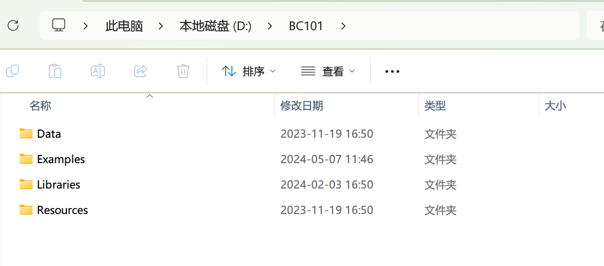
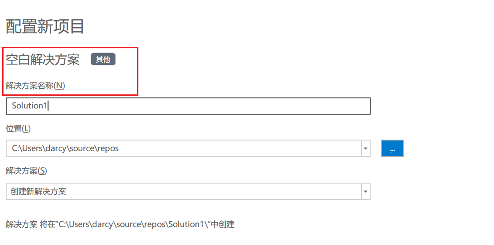
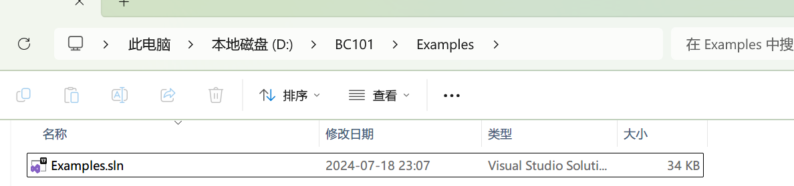
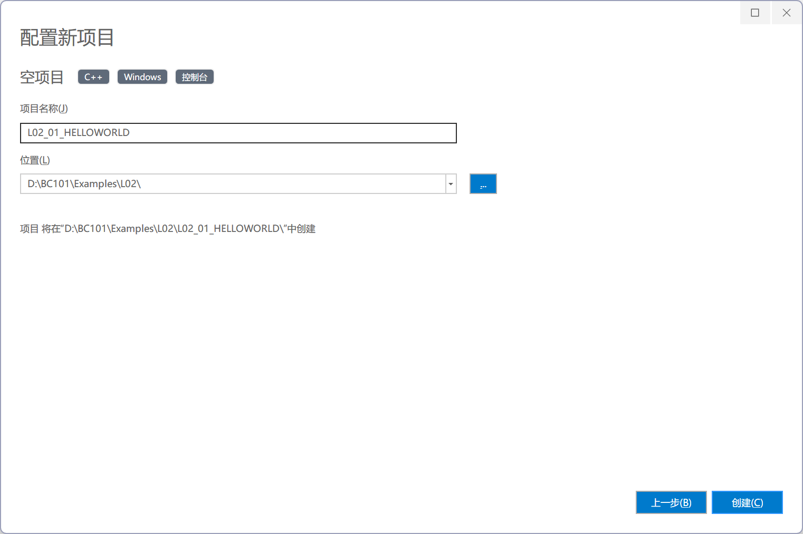
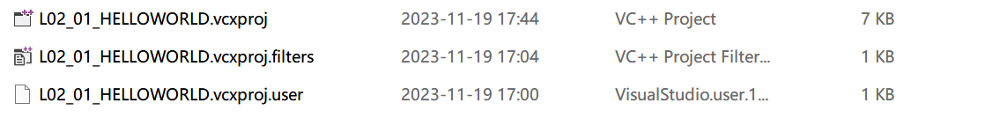
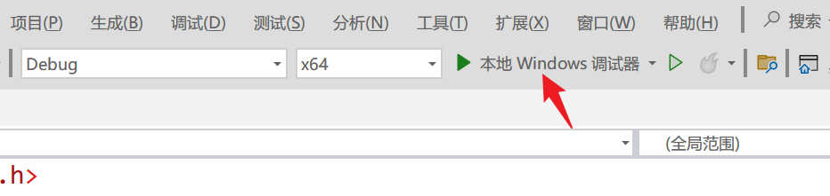
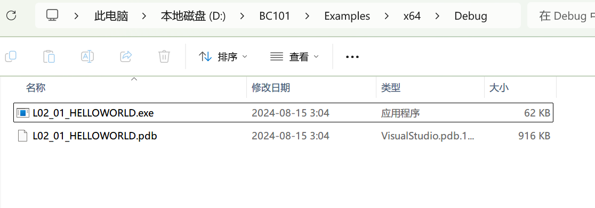

## 项目目录 



- Data目录。用于存储程序运行产生的数据文件，未来从网络读入的外汇牌价数据将以文件形式存入其中。
- Examples目录。用于存放创建的解决方案、项目文件、源代码文件。
- Libraries目录。未来要使用的第三方库的相关文件将存入此目录。
- Resources目录。未来要使用的资源文件（如各国国旗、行政区旗的图片将存入此目录）。

## 解决方案





Examples.sln 是**解决方案文件**（sln 是 solution 的缩写），未来创建的新项目可以加入到这个解决方案中。

双击该文件可以一次性打开多个项目。

## 第一个项目

在解决方案中新建项目



Visual Studio 创建的项目相关文件



.vcxproj 它是这个C++项目的项目文件，可以通过双击打开该项目。大多数情况下我们都选择打开解决方案文件，因为它可以一次打开多个项目。

### 第一个 C 语言程序

HelloWorld.cpp

```c
#include <stdio.h>

int sayHello() {
	printf("Hello, World\n");
	return 0;
}

int main() {
	sayHello();
	return 0;
}
```

运行程序



Visual Studio 在运行程序前会在 D:\BC101\Examples\x64\Debug 目录下创建一个.exe 文件，名称为 L02_01_HELLOWORLD.exe，它就是编译器生成的可执行文件。



L02_01_HELLOWORLD.pdb 是程序调试数据库。